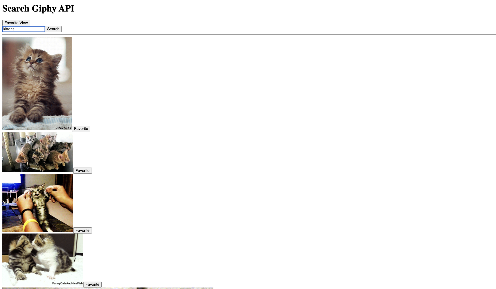

# PROJECT NAME

The Great Giphy Saga!

Collaborators: Tierra, Michael & Sumeiya

## Description

_Duration: 2 day project

Welcome to the Giphy Searching and Favoriting application! This tool allows you to search for GIFs using the Giphy API, save your favorite images, and organize them into categories for easy access.

Key Features:

Search for GIFs: Enter a search term and browse through the results.
Favorite GIFs: Save your favorite GIFs to view later.
Categorize Favorites: Organize your favorite GIFs into custom categories.

## Screen Shot

### Prerequisites

Link to software that is required to install the app (e.g. node).

- [Node.js](https://nodejs.org/en/)
- [Postgres](https://www.postgresql.org/download/)
- [Postico](https://eggerapps.at/postico/)
- [GiphyAPI](https://developers.giphy.com/)

## Installation

1. Create a database named `giphy_search_favorites`,
2. The queries in the `database.sql` file are set up to create all the necessary tables and populate the needed data to allow the application to run correctly. The project is built on postgress, so you will need to make sure to have that installed. We recommend using Postico to run those queries as that was used to create the queries, 
3. Open up your editor of choice and run an `npm install`
5. Run `npm run server` in your terminal
6. Run `npm run client` in your terminal
7. The `npm run client` command will open up a new browser tab for you!

## Usage
-Home page displays the search engine, which is just a search input and button. 
-You can search any 

## Built With

- *SQL
- *Express
- *React
- *Redux
- *Node
- *Redux Saga

## Up and Coming
- Complete favorites page, so gifs added to favorites can show up all on one page. 
- Ability to assign gifs to categories

